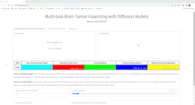

    
    
# Multi-task Brain Tumor Inpainting with Diffusion Models

    

  
    
**Pouria Rouzrokh1,2,*, Bardia Khosravi1,2,*, Shahriar Faghani1, Mana Moassefi1, Sanaz Vahdati1, Bradley J. Erickson1,+**
 
(1) Mayo Clinic Artificial Intelligence Laboratory (2) Orthopedic Surgery Artificial Intelligence Laboratory
  
(*) co-first authors (+) corresponding author  
    
#### <a href="url">[Link to the Manuscript]</a> | <a href="https://3f88c3e6e58fee58.gradio.app">[Link to the Online Tool]</a>

 

*** 
 

**Multitask Brain Tumor Inpainting (MBTI)** is a denoising diffusion probabilistic model (DDPM), developed by the *Mayo Clinic Artificial Intelligence Laboratory*, that can be used to inpaint an axial slice of a brain magnetic resonance imaging (MRI) in either of the T1-weighted, post-contrast T1-weighted, T2-weighted, or Fluid attenuation inversion recovery (FLAIR) sequences. "Inpainting" refers to the ability of the proposed model to fill one or multiple cropped areas of an input image (i.e., a two-dimensional axial brain MRI slice) with tumor-free (apparently normal) brain tissue, necrotic tumor core, tumoral edema, tumoral enhancement, or a combination of the tumoral components. Similarly, the term "multitask" means that the model is able to simultaneously inpaint various cropped regions of the input image with distinct components (in a single inference run). Please refer to our [manuscript]() for further information about our tool.s
 

 
 
<kbd>

</kbd>
    

 
The current repository includes both an online tool for utilizing our model and the source code for the UNet model which was used to train our algorithm (adopted from <a href=https://github.com/openai/improved-diffusion>here</a>). 

***

# How to use our online tool:

Our online tool is a graphical user interface made possible by [Gradio](https://gradio.app) that illustrates how our program can be used to generate synthetic image data. **This tool is accessible using the hyperlink provided on top of this page.** Please watch the demo animation above to discover how to use our tool, or continue reading to learn its specs.

> **Note**: If you are interested in using our tool in a more flexible manner (for example, to apply it to your projects or a large dataset), please contact us using the email addresses listed at the bottom of this page.

### Instructions for uploading an input image:

- You can drag and drop your desirable image into the "input image" placeholder, or click on that placeholder to open an upload dialog box for selecting your image.
- Uploaded input images should be axial slices from brain magnetic resonance imaging (MRI) in either of the following slices: T1-weighted, post-contrast T1-weighted, T2-weighted, or Fluid attenuation inversion recovery (FLAIR).
- In order for our tool to work properly, the uploaded input images should be pre-processed as are the images in the <a href="http://braintumorsegmentation.org/">BRATS 2021 dataset</a> (e.g., skull-stripped), and have no lower resolution than 240 * 240. 
- If you just need a few example images to try our app, feel free to download some from <a href="https://drive.google.com/drive/folders/1SdQpcgQU8JPE7K-1NKXJDMIwIG9qIiMF?usp=sharing">this link</a>. These examples all come from a subset of BRATS2021 dataset that was held out as a separate test set for our deep learning model.

### Instructions for annoting the the input image:
- Once an appropriate input image has been uploaded, the next step is to annotate your desired region of interests (ROIs) on the input image. You can draw your annotations by  utilizing the color-sketch tool that is accessible on top of the input-image placeholder.
- Please note that this interface has been designed so that our product is compatible with particular annotation colors. In other words, only certain RGB values should be used for the model to comprehend the ROI you wish to inpaint.
- Utilize the color picker tool to select the color that corresponds to your desired ROI. After selecting the color-picking tool, please click on the colored portion of any of the color boxes below the input image to draw with that color (please watch the demo above to see how this works).
- If you are using a non-standard monitor, such as a mobile device, the color-picker tool may select non-standard pixel values; therefore, it is advisable to manually enter the RGB values for your ROI brush color. The following table displays the RGB values for the various ROIs that can be annotated on input images:

    
<table style="max-width:500px; border:1px solid black;">
  <tr>
    <th align='left'> Region of Interest (ROI)</th>
    <th>Red</th>
    <th>Green</th>
    <th>Blue</th>
  </tr>
  <tr>
    <td> Tumor-less brain tissue</td>
    <td>0</td>
    <td>255</td>
    <td>255</td>
  </tr>
  <tr>
    <td> Necrotic Tumor Core</td>
    <td>255</td>
    <td>0</td>
    <td>0</td>
  </tr>
  <tr>
    <td> Tumoral Edema</td>
    <td>0</td>
    <td>255</td>
    <td>0</td>
  </tr>
  <tr>
    <td> Tumoral Enhancement</td>
    <td>0</td>
    <td>0</td>
    <td>255</td>
  </tr>
  <tr>
    <td> Mixed Tumoral Components</td>
    <td>255</td>
    <td>255</td>
    <td>0</td>
  </tr>
</table>
    

- You can select the checkbox for any of the ROIs you have drawn to have our tool treat it as a bounding box. Please note that in the bounding box mode, synthetic pixels will be created within the annotated bounding box such that it is the smallest bounding box that can fit around the ROI. However, the resulting ROI will not completely fill the bounding box. In other words, our model will decide for itself what contour the ROI should have and will fill in the surrounding environment with tumor-free brain tissue.
- In order for the Gradio interface to function correctly with our tool, we must slightly dilate your drawn ROI masks prior to feeding them to the model. This may result in the inpainted region of the input image being slightly larger than the ROI you initially drew.

### Instructions for running the model:
- Once you have uploaded and annotated your image, you may press the "inpaint" button to have our model generate the output image.
- DDPM models are not deterministic by themselves.  By adjusting the **seed** to any value other than zero, the model can be made to run in a deterministic manner. In other words, the identical input image and mask should provide the same output image. Seed=0 indicates a random seed.
- For the inference runs, we have switched our model to a denoising diffusion implicit model (DDIM). This indicates that you can now adjust the amount of steps the model takes to denoise the input image and generate the synthetic one. Reducing the amount of **denoising steps** will increase inference speed, although occasionally at the sacrifice of image quality.
- Increasing the **conditioning weight** can force the model to produce more realistic-looking tissue, but may also distort your results.
- The 25-step process of inpainting can take up to 20 seconds for the model.
- We configured the Gradio interface to handle a restricted number of requests concurrently. If others are using the app before you, you may have to wait in a queue before you can use it.

***

# About the Mayo Clinic Artificial Intelligence Laboratory:

The <b>Mayo Clinic Artificial Intelligence (AI) Laboratory</b>, located at Rochester, Minnesota, USA, is directed by Dr. Bradley Erickson and focuses on enhancing patient care by developing and deploying advanced machine learning (ML) solutions for a number of medical specialties, including diagnostic radiology, pathology, cardiology, etc. To learn more about the Mayo Clinic AI Laboratory and read about our recent publications, please feel free to follow our <a href='https://twitter.com/MayoAILab'> Twitter account </a> or have a look at <a href='https://mayo-radiology-informatics-lab.github.io/MIDeL/index.html?fireglass_rsn=true#fireglass_params&tabid=a9514a92a071c5e0&start_with_session_counter=2&application_server_address=mc3.prod.fire.glass'>the Massive Open Online Course (MOOC)</a> our lab has created to explain machine learning (ML) to individuals who are eager to apply it to healthcare.

### Developers of the Multitask Brain Tumor Inpainting Tool:
The following data scientists contributed to developing the Multitask Brain Tumor Inpainting tool:

| | | 
|---|---|
|||
|||
|||

### Contact us:

IF you are interested in collaborating with our lab (e.g., to use our tool for a project), or to give us feedback or report an issue, please send a note to either of the following email adresses:
- rouzrokh.pouria@mayo.edu
- khosravi.bardia@mayo.edu
- bje@mayo.edu
